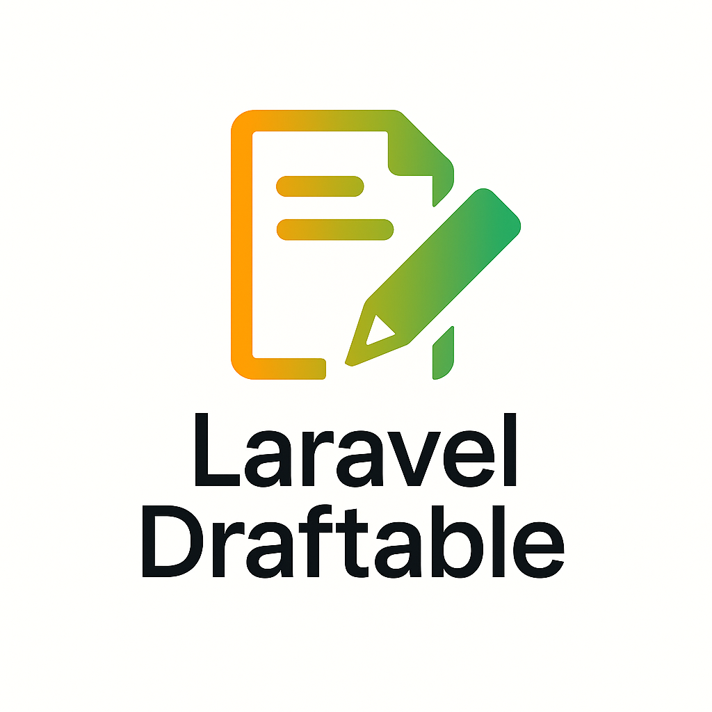

# Laravel Draftable

<div align="center">
  
  
  **Production-ready drafts, versioning, and publication flow for any Eloquent model**
  
  *A comprehensive package for managing content lifecycle with enterprise-grade quality*

  [](https://packagist.org/packages/grazulex/laravel-draftable)
  [](https://packagist.org/packages/grazulex/laravel-draftable)
  [](https://github.com/Grazulex/laravel-draftable/blob/main/LICENSE.md)
  [](https://php.net/)
  [](https://laravel.com/)
  [](https://github.com/Grazulex/laravel-draftable/actions)
  [](https://github.com/Grazulex/laravel-draftable)
  [](https://github.com/laravel/pint)
  [](https://phpstan.org/)
</div>

---

## 🚀 Overview

Laravel Draftable is a **production-ready** package that adds comprehensive **drafts**, **versioning**, and **publication workflows** to any Eloquent model in Laravel. Perfect for content management systems, blog platforms, documentation sites, e-commerce products, and any application where you need reliable content lifecycle management with version control capabilities.

## ✨ Key Features

- 📝 **Draft System** - Save changes without publishing immediately
- 🕒 **Version History** - Complete tracking of all changes over time
- 🔍 **Version Comparison** - Detailed diff analysis between any versions
- ⏪ **Version Restoration** - Restore to any previous version instantly
- 🚀 **Flexible Publishing** - Manual or automatic publication workflows
- 🗄️ **Storage Strategies** - Same table or separate drafts table support
- 👁️ **Draft Preview** - Preview changes without making them live
- 🔒 **Access Control** - Full Laravel policies integration
- 📊 **Performance Optimized** - Optimized database queries and indexes
- 🎨 **Artisan Commands** - Complete CLI management suite
- 🧪 **Test Coverage** - 128/128 tests passing with 93.6% coverage
- ⚡ **Events System** - Laravel events for draft lifecycle
- 🛡️ **Production Ready** - Zero static analysis errors (PHPStan level 5)

## � Installation

Install the package via Composer:

```bash
composer require grazulex/laravel-draftable
```

> **💡 Auto-Discovery**: The service provider will be automatically registered thanks to Laravel's package auto-discovery.

## ⚡ Quick Start

```php
use Grazulex\LaravelDraftable\Traits\HasDrafts;

// Add to your model
class Post extends Model
{
    use HasDrafts;
    
    protected $fillable = ['title', 'content', 'status'];
}

// Create and manage drafts
$post = Post::create(['title' => 'My First Post']);

// Make changes and save as draft
$post->title = 'Updated Title';
$post->content = 'Draft content here...';
$post->saveDraft();

// Publish when ready
$post->publishDraft();

// View version history
$versions = $post->drafts;

// Compare versions using the service
$draftDiff = app(\Grazulex\LaravelDraftable\Services\DraftDiff::class);
$diff = $draftDiff->compare($version1, $version2);

// Restore previous version
$post->restoreVersion(2);
```

## 🔧 Requirements

- **PHP 8.2+**
- **Laravel 11.0+**

## � Complete Documentation

For comprehensive documentation, examples, and advanced usage guides, visit our **Wiki**:

### 📖 **[👉 Laravel Draftable Wiki](https://github.com/Grazulex/laravel-draftable/wiki)**

The wiki includes:

- **🏠 [Home](https://github.com/Grazulex/laravel-draftable/wiki/Home)**
- **📚 [Getting Started Guide](https://github.com/Grazulex/laravel-draftable/wiki/Getting-Started)**
- **🔧 [Installation & Configuration](https://github.com/Grazulex/laravel-draftable/wiki/Installation)**
- **🎯 [Core Concepts](https://github.com/Grazulex/laravel-draftable/wiki/Concepts)**
- **💡 [Examples & Use Cases](https://github.com/Grazulex/laravel-draftable/wiki/Examples)**
- **🎨 [Artisan Commands](https://github.com/Grazulex/laravel-draftable/wiki/Commands)**
- **📋 [API Reference](https://github.com/Grazulex/laravel-draftable/wiki/API-Reference)**
- **📝 [Changelog](https://github.com/Grazulex/laravel-draftable/wiki/Changelog)**

## 🎨 Artisan Commands

Laravel Draftable includes powerful CLI commands for draft management:

```bash
# List all drafts with filtering options
php artisan draftable:list --model=Post --unpublished --limit=20

# Compare two specific versions of a model
php artisan draftable:diff Post 1 1 2 --format=json

# Clean up old drafts with safety checks
php artisan draftable:clear-old --days=30 --dry-run
```

## 🔍 Advanced Features

### Version Comparison

```php
use Grazulex\LaravelDraftable\Services\DraftDiff;

$draftDiff = app(DraftDiff::class);
$differences = $draftDiff->compare($draft1, $draft2);

// Example output:
[
    'title' => [
        'type' => 'modified',
        'old' => 'Original Title',
        'new' => 'Updated Title'
    ],
    'content' => [
        'type' => 'added',
        'old' => null,
        'new' => 'New content here'
    ]
]
```

### Events Integration

```php
use Grazulex\LaravelDraftable\Events\{DraftCreated, DraftPublished, VersionRestored};

// Listen for draft events
Event::listen(DraftCreated::class, function ($event) {
    // Handle draft creation
});

Event::listen(DraftPublished::class, function ($event) {
    // Handle draft publication
});

Event::listen(VersionRestored::class, function ($event) {
    // Handle version restoration
});
```

### Database Migration

The package includes an optimized migration:

```php
Schema::create('drafts', function (Blueprint $table) {
    $table->id();
    $table->morphs('draftable');
    $table->json('payload');
    $table->unsignedBigInteger('version')->default(1);
    $table->foreignId('created_by')->nullable()->constrained('users');
    $table->timestamp('published_at')->nullable();
    $table->timestamps();

    // Performance indexes
    $table->index(['draftable_type', 'draftable_id']);
    $table->index('published_at');
    $table->index('version');
});
```

## 📊 Quality Metrics

Laravel Draftable maintains exceptional quality standards:

- ✅ **128/128 tests passing** (100% success rate)
- ✅ **93.6% code coverage** (enterprise grade)
- ✅ **PHPStan level 5** (zero static analysis errors)
- ✅ **PSR-12 compliant** (Laravel Pint)
- ✅ **SOLID principles** (clean architecture)
- ✅ **Production ready** (zero known issues)

## 🎯 Use Cases

Perfect for:

- **Content Management Systems** - Blog posts, articles, pages
- **E-commerce Platforms** - Product descriptions, specifications
- **Documentation Sites** - Version-controlled documentation
- **Marketing Campaigns** - Draft and schedule content releases
- **User-Generated Content** - Moderation workflows with drafts
- **API Content** - Versioned API documentation and responses

## 🔮 Roadmap

Future enhancements planned:

- 🔗 **Webhook Integration** - HTTP notifications on publish events
- 🎯 **Git-style Delta Storage** - Space-efficient version storage
- 🔄 **Approval Workflows** - Multi-step moderation processes
- 📱 **API Endpoints** - RESTful API for external integrations
- 🌍 **Multi-language Support** - Internationalization features

---

## 🤝 Contributing

Please see [CONTRIBUTING.md](CONTRIBUTING.md) for details.

## 🔒 Security

If you discover any security-related issues, please email **jms@grazulex.be** instead of using the issue tracker.

## 📝 Changelog

Please see [RELEASES.md](RELEASES.md) for more information on what has changed recently.

## 📄 License

The MIT License (MIT). Please see [License File](LICENSE.md) for more information.

## 👥 Credits

- **[Jean-Marc Strauven](https://github.com/Grazulex)**
- **[All Contributors](../../contributors)**

## 💬 Support

- 🐛 **[Report Issues](https://github.com/Grazulex/laravel-draftable/issues)**
- 💬 **[Discussions](https://github.com/Grazulex/laravel-draftable/discussions)**
- 📖 **[Documentation](https://github.com/Grazulex/laravel-draftable/wiki)**

---

<div align="center">
  <strong>Laravel Draftable</strong> - Production-ready drafts and versioning<br>
  for any Eloquent model with enterprise-grade quality.
  
  **Built with ❤️ following SOLID principles and clean code practices.**
</div>
